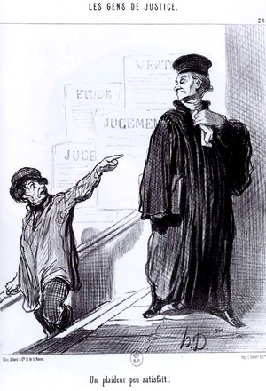

# Datachase Parser

Evaluates the HTML documents contained on the WestLaw website where prior permission has been granted
to perform offline evaluation of the content.

### Python Installation
These scripts run best with python3. Install python3 and pip3.
Create a virtual environment and activate it.
Install package prerequisites using:
```bash
python3 -V
python3 -m venv ./venv
source ./venv/bin/activate
pip3 install -r requirements.txt
```


### Other Installations
These scripts use Selenium to access a Firefox browser and the gecko driver to query and navigate the WestLaw site.
First ensure Firefox is available on your machine. The code and Selenium tools are largely browser agnostic
but not currently configurable. Download Firefox, ensure it runs, then download the
[gecko driver](https://github.com/mozilla/geckodriver/releases) for Selenium
and add it to your system PATH.
```bash
mkdir -p ~/src/driver/gecko && cd ~/src/driver/gecko
wget https://github.com/mozilla/geckodriver/releases/download/v0.20.1/geckodriver-v0.20.1-macos.tar.gz
tar -xvf geckodriver-v0.20.1-macos.tar.gz
export PATH=$PATH:~/src/driver/gecko
which geckodriver
```
### Usage
Launch a new browser and start parsing. You will be prompted for your WestLaw password.
```bash
python3 datachase.py --user myuser --infile my_cases.csv --outfile out.csv
```
### File Input
You can describe cases you're interested in using an input file (--infile) in
the following format:
```bash
2009 WL 82715
2011 WL 6157466
285 Fed. Appx. 326 (8th Cir. 2008)
"286 Fed. Appx. 383 (9th Cir. July 15, 2008)"
290 Fed. Appx. 203 (10th Cir. 2008)
```

### Query Input
Or you can describe the cases you're interested in using any valid WestLaw query (--query)
```bash
adv: TI("big waiver")
```

### File Output
The cases are parsed and their summaries are written to a new CSV (--outfile)



### briefchase.py
This modified script pulls some data from case docket pages and downloads the HTML versions of party briefs. Run it like so:
```bash
python3 briefchase.py --user myuser --infile my_cases.csv --informat single OR fjc
```

The script takes two formats. The __single__ format:
```bash
119 F.3d 772
2009 WL 82715
2011 WL 6157466
285 Fed. Appx. 326 (8th Cir. 2008)
286 Fed. Appx. 383 (9th Cir. July 15, 2008)
290 Fed. Appx. 203 (10th Cir. 2008)
```

Or, a more specialized, __FJC__ format, derived from a slimmed down version of the [Federal Judicial Center's courts of appeals data](https://www.fjc.gov/research/idb/interactive/IDB-appeals-since-2008):

| Circuit | Docket   | Appellant Name | Appellee Name | Date of Decision |
|---------|----------|----------------|---------------|------------------|
| 9       | 03-99002 | Ryan           | McMurtrey     | 08/21/2008       |
| 9       | 03-99003 | Woodford       | Pinholster    | 05/02/2008       |
| 9       | 03-99009 | McMurtrey      | Ryan          | 08/21/2008       |


The dockets are parsed and their summaries are written to a CSV while the party briefs are downloaded as HTML files to directories named after either the docket or the case citation. All of this is saved in the output directory.

### Troubleshooting
Selenium can be run in interactive mode, so you'll actually watch the
browser navigating. Combined with a Python IDE with breakpoints and the browser's
developer tools and view source, this is generally all
you need. Firefox writes a log which can b useful as well.

### OS Notes
These instructions assume a linux-based OS.
Windows users now have Linux [too](https://docs.microsoft.com/en-us/windows/wsl/install-win10).


